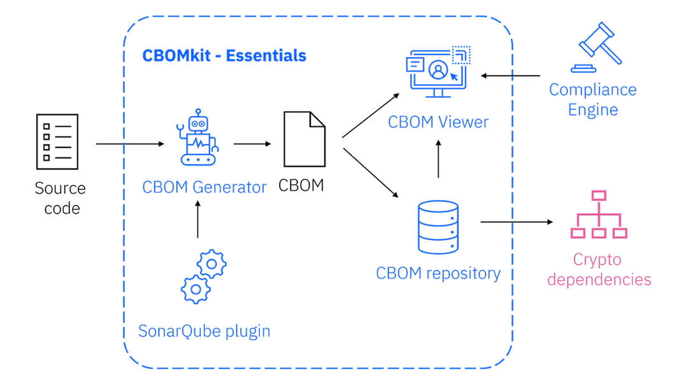

# Demo PQC - vérification manuelle et CBOM

## CBOM et cbomkit




- [CBOM](https://github.com/IBM/CBOM)
- [cbomkit](https://github.com/cbomkit/cbomkit)
- [cbomkit-theia](https://github.com/cbomkit/cbomkit-theia)
- [cbomkit - présentation plateforme par IBM](https://research.ibm.com/blog/quantum-safe-cbomkit)

## Build des images `cbomkit-theia` et `redhat/ubi10-pqc-activated`

```sh
# obtenir et le cli builder cbomkit-theia
mkdir /tmp/cbomkit-theia
cd /tmp/cbomkit-theia
git clone git@github.com:cbomkit/cbomkit-theia.git .
docker build -t cbomkit-theia .
cd -

# builder image redhat/ubi10 avec activation PQC au démmarage
docker build -t pqc-enabled -f ./images/redhat10/Dockerfile.redhat10-pqc-enabled ./image
s/redhat10

```


```sh
# environnement de travail
mkdir -p results
alias cbomkit-theia="docker run --rm cbomkit-theia"


# scan redhat/ubi10-micr0 upstream
cbomkit-theia image -p opensslconf,certificates redhat/ubi10-micro:latest > results/ubi10-micro-cbom.json

# scan redhat10 pqc-enabled à partir du registre local
docker run --rm \
  -v /var/run/docker.sock:/var/run/docker.sock \
  cbomkit-theia image -p opensslconf,certificates pqc-enabled \
  > results/pqc-enabled-cbom.json

# extraires les infos pertinentes
cbom_report results/ubi10-micro-cbom.json
cbom_report results/pqc-enabled-cbom.json


# Vérifier version openssl
docker run --rm pqc-enabled openssl version

# ML-KEM disponible?
docker run --rm pqc-enabled openssl list -kem-algorithms | grep "ML-KEM MLKEM X25519MLKEM"


# tester une connection
check_pqc_support(){
  URL=$1
  docker run --rm pqc-enabled sh -lc "echo | openssl s_client -connect $URL:443 -servername $URL -tls1_3 -groups X25519MLKEM768 -brief 2>&1 | grep -Ei 'Protocol|Ciphersuite|Server Temp Key|MLKEM|Verification'"

}

check_pqc_support www.cloudflare.com
check_pqc_support quebec.ca